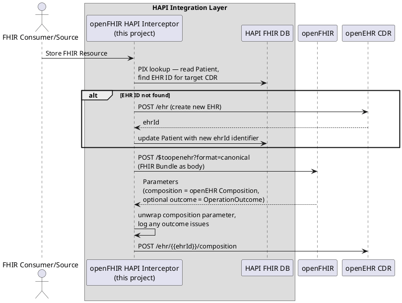
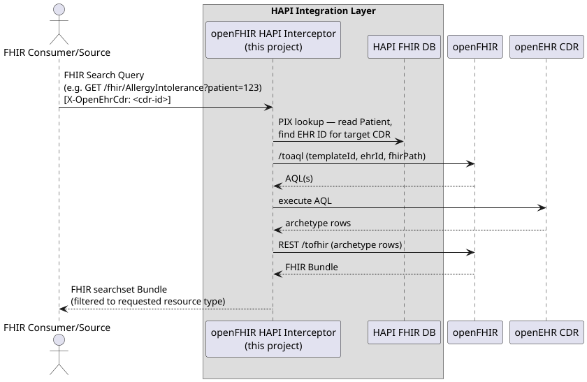
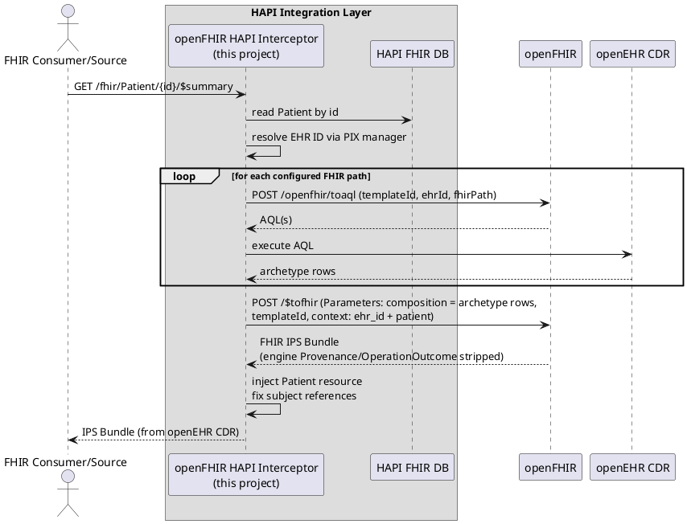

[](LICENSE)

# openFHIR HAPI Interceptor

This project is a HAPI FHIR server filter/interceptor that transparently routes clinical data between FHIR
clients and an openEHR Clinical Data Repository (CDR). It sits inside a standard HAPI FHIR server
and acts as an integration layer — selectively intercepting requests that should be handled by the
CDR while letting everything else pass through to HAPI as normal.

The translation between FHIR and openEHR formats is handled by
[openFHIR](https://open-fhir.com/), a mapping service that converts FHIR resources to openEHR
Compositions and vice versa using configurable template-based mappings.

> This is simply an interceptor designed to operate on an already running HAPI FHIR server. It is not intended to modify
> or customize HAPI itself, but rather to make use of HAPI’s established request interception patterns. See "How to use it"
> section before on how you can use it within your HAPI server.

> See https://github.com/openFHIR/openfhir-firely-plugin if you're looking for a Firely Plugin.

> **Compatibility:** this version of the interceptor only works with **openFHIR >= 3.0.0** — it uses the
> `$tofhir` / `$toopenehr` FHIR operations introduced in openFHIR 3.0.0. If you need a plugin that works with
> openFHIR < 3.0.0, look into the old `1.x` version of this project instead.

## How it works

### Storing FHIR data in openEHR

When a FHIR resource is posted with a profile that matches a configured list, the interceptor
forwards it to openFHIR for conversion into an openEHR Composition, then stores it directly in the
CDR. The resource never reaches HAPI's storage layer.



### Querying openEHR data as FHIR

When a FHIR search request matches a configured rule, the interceptor translates it to an openEHR
AQL query via openFHIR, executes it against the CDR, then converts the results back to FHIR before
returning them to the client. Again, HAPI is not involved.



### Serving an IPS patient summary (`$summary`)

The interceptor also exposes a HAPI operation provider for the standard FHIR
`GET /fhir/Patient/{id}/$summary` operation, returning an
[International Patient Summary (IPS)](https://hl7.org/fhir/uv/ips/) Bundle gathered from the configured openEHR CDR.

The openEHR template ID used for the `$summary` operation is configurable via `interceptor.ips.template-id`.

> Implementation is at this time limited only to Allergies and Conditions.



---

## How to use it

HAPI FHIR supports loading additional classes from a JAR placed on the classpath via its
`extra-classes` mechanism. This project produces a JAR that is dropped into a standard HAPI Docker
image — no modifications to HAPI itself are required.

### Building the image

A `Dockerfile` is provided that builds the interceptor JAR and layers it into the official HAPI
image:

```dockerfile
FROM maven:3.8.3-openjdk-17 AS builder
WORKDIR /app
COPY ./pom.xml /app/pom.xml
RUN mvn dependency:go-offline
COPY ./src /app/src
RUN mvn clean package -DskipTests

FROM hapiproject/hapi:v8.2.0-2
COPY --from=builder /app/target/*.jar /app/extra-classes/
ENV HAPI_FHIR_IPS_ENABLED=true
```

The `extra-classes` directory is automatically picked up by HAPI on startup.

> See more on how HAPI handles this at official HAPI documentation: https://github.com/hapifhir/hapi-fhir-jpaserver-starter/blob/master/README.md#example-running-custom-interceptor-using-docker-compose

### Registering the interceptors

HAPI needs to know which packages to scan for Spring beans and which interceptor classes to
register. Add the following to your `application.yml`:

```yaml
hapi:
   fhir:
      custom_bean_packages: com.syntaric          # scans all beans in this project
      custom_interceptor_classes: com.syntaric.hapi.PatientInterceptor
```

### Running a whole stack with Docker Compose

A `docker-compose.yml` is provided as a reference that wires HAPI together with EHRbase and its
PostgreSQL database:

```yaml
services:
   hapi:
      build: .
      ports:
         - "8080:8080"
      volumes:
         - ./application.yml:/app/config/application.yml:ro
         - ./cdrs.yml:/etc/cdrs.yml
```

The `application.yml` is mounted as HAPI's configuration file. The `cdrs.yml` is mounted at the
path referenced by `interceptor.cdrs-config-file` in `application.yml`.

Start everything with:

```bash
docker compose up --build
```

> You either need to include an openFHIR container in the docker-compose or configure your sandbox access.

### Integration tests

`tests/test.sh` is the end-to-end suite. It stands up the full stack with Docker Compose — HAPI
with this interceptor built from source, openFHIR, EHRbase, MongoDB and two PostgreSQL databases —
and runs a Postman collection through Newman covering Patient create → EHR provisioning, the
openFHIR `$tofhir` / `$toopenehr` operations, the FHIR↔openEHR round trip and `$summary`.

Prerequisites:

- Docker with Compose v2
- Newman: `npm install -g newman`
- A valid openFHIR license at `tests/licenses/openfhir-license.json` (gitignored — supply your own)

Run it with:

```bash
./tests/test.sh
```

A cold run takes roughly 10–18 minutes. The stack is torn down afterwards either way; on failure
the container logs are written to `tests/docker-logs.txt` first. Newman results are also exported
as JUnit XML to `tests/newman-report.xml`.

The openFHIR image tag defaults to a pinned version and can be overridden, for example to test
against a fresh local build:

```bash
OPENFHIR_IMAGE_TAG=build ./tests/test.sh
```

CI runs this suite on every pull request to `main`, and it is a hard gate on the release
workflow — nothing is tagged or published unless it passes. It requires the repository secret
`OPENFHIR_LICENSE_JSON`; pull requests from forks cannot read it, so the job skips there.

---

## Configuration

You need to configure the connected openEHR CDRs along with your openFHIR instance.

The following configuration options are available (see the example in application.yml[application.yml](application.yml)):

### CDR registry (`cdrs-config-file`)

The interceptor can target multiple openEHR CDRs. The registry is defined in a separate YAML file
whose path is set via:

```properties
interceptor.cdrs-config-file=/etc/cdrs.yml
```

The file is re-read on every request — no restart is required when CDR entries are added or changed.

Example configurations: [cdrs.yml](cdrs.yml).

**`cdrs.yml` format:**

```yaml
- id: local                            # unique identifier, used in X-OpenEhrCdr header
  name: EHRbase (local)               # human-readable label (informational only)
  baseUrl: http://ehrbase:8080/ehrbase/rest  # base REST URL of the CDR
  authMethod: basic                   # none | basic | oauth2
  basicAuth:
     username: ehrbase-user
     password: secret

- id: remote
  name: Cadasto
  baseUrl: https://cadasto.example.com
  authMethod: oauth2
  oauth2:
     tokenUrl: https://auth.example.com/token
     clientId: my-client
     clientSecret: my-secret
     scope: openid profile              # optional, space-separated
     authMethod: body                   # body (default) or basic — how credentials are sent to the token endpoint
     extraParams:                       # optional extra key/value pairs added to the token request body
        audience: cadasto-api
```

**CDR entry fields:**

| Field | Required | Description |
|---|---|---|
| `id` | yes | Unique identifier matched against the `X-OpenEhrCdr` request header |
| `name` | no | Human-readable label, used only in logs |
| `baseUrl` | yes | Base REST URL of the CDR (no trailing slash) |
| `authMethod` | yes | `none`, `basic`, or `oauth2` |
| `basicAuth.username` | if `authMethod: basic` | HTTP Basic username |
| `basicAuth.password` | if `authMethod: basic` | HTTP Basic password |
| `oauth2.tokenUrl` | if `authMethod: oauth2` | Token endpoint URL |
| `oauth2.clientId` | if `authMethod: oauth2` | OAuth2 client ID |
| `oauth2.clientSecret` | if `authMethod: oauth2` | OAuth2 client secret |
| `oauth2.scope` | no | Space-separated scopes added to the token request |
| `oauth2.authMethod` | no | How to send credentials to the token endpoint: `body` (default) or `basic` |
| `oauth2.extraParams` | no | Additional key/value pairs added to the token request body (e.g. `audience`) |

The CDR to use on a given request is selected via the `X-OpenEhrCdr` request header, matched
against the `id` field.

| Scenario | Behaviour |
|---|---|
| Header present, known `id` | routes to that CDR |
| Header present, unknown `id` | falls back to first CDR (warns) |
| Header absent | falls back to first CDR (warns) |
| Header value is `fhir` | passes through to HAPI (create flow only) |

### openFHIR service (`openfhir.base-url`)

The configured openFHIR instance must be **version 3.0.0 or newer** — the interceptor calls the
`POST /$tofhir` and `POST /$toopenehr` FHIR operations (plus the legacy `/openfhir/toaql`).

```properties
openfhir.base-url=https://sandbox.open-fhir.com

# optional OAuth2 for the openFHIR service itself
openfhir.oauth2.token-url=https://sandbox.open-fhir.com/auth/realms/open-fhir/protocol/openid-connect/token
openfhir.oauth2.client-id=my-client
openfhir.oauth2.client-secret=my-secret
```

---

## Technical Details

### FhirCreateFilter

A servlet filter (order 1) that sits in front of HAPI FHIR and intercepts inbound `POST` requests,
routing them to an OpenEHR CDR instead of letting HAPI store them, when a configured profile matches.

#### When it triggers

A request is intercepted when **all** of the following are true:

1. The HTTP method is `POST`
2. The `X-Target-CDR` request header is present and is not `fhir` (requests explicitly targeting HAPI pass through)
3. The parsed FHIR resource has at least one entry in `meta.profile` that matches a URL in
   `interceptor.fhir-create-filter.intercepted-profiles`


Profile matching checks the resource itself first. For `Bundle` resources, if the bundle's own meta does not match, each
entry resource is also checked in order.

#### Flow

```
POST /fhir
    │
    ├─ not POST?                        → pass through to HAPI
    ├─ no or "fhir" X-Target-CDR header? → pass through to HAPI
    ├─ body not parseable as FHIR?      → pass through to HAPI
    ├─ no configured profile matched?   → pass through to HAPI (logged at INFO)
    │
    └─ profile matched (logged at INFO)
           │
           ├─ resolve patient ID from resource
           │     ├─ Bundle → recurse into each entry resource
           │     └─ any resource type → try per-type FHIRPath expressions in order
           │           (e.g. Observation: subject → performer)
           │           filters to references of type Patient, returns first non-blank ID part
           ├─ look up EHR ID via PIX manager (local patient hapi store)
           │     └─ if not found → provision new EHR on CDR
           ├─ convert resource to openEHR format via openFHIR POST /$toopenehr?format=canonical
           │     (FHIR Bundle sent directly as the body; the composition JSON comes back in
           │      Parameters.parameter[name=composition].valueString; engine warnings in the
           │      optional outcome parameter are logged)
           ├─ store on CDR
           └─ return HTTP 201 + Location header  (HAPI never sees the request)
```

#### Configuration

```properties
# Profiles that trigger the OpenEHR forwarding flow.
# Any resource whose meta.profile contains one of these URLs is intercepted.
# Defaults to the IPS Composition profile if not set.
interceptor.fhir-create-filter.intercepted-profiles[0]=http://hl7.org/fhir/uv/ips/StructureDefinition/Composition-uv-ips
# Add more profiles as needed:
# interceptor.fhir-create-filter.intercepted-profiles[1]=http://example.org/fhir/StructureDefinition/MyProfile
```

#### Patient reference resolution

The filter must extract a patient ID from the resource in order to look up or provision an EHR.
For `Bundle` resources it recurses into each entry. For all other resource types it tries a set of
FHIRPath expressions in priority order, keeping the first reference whose resource type is `Patient`
(or is untyped).


---

### FhirQueryFilter

A servlet filter (order 2) that intercepts FHIR search `GET` requests and routes them to OpenEHR
instead of HAPI. Which requests are intercepted is fully driven by configuration — there are no
hardcoded resource types or template IDs.

#### When it triggers

A request is intercepted when **all** of the following are true:

1. The HTTP method is `GET`
2. A `patient` query parameter is present (used to resolve the EHR ID)
3. At least one configured rule matches the request (see Configuration below)

If no rule matches, the request passes through to HAPI (logged at INFO).

#### Flow

```
GET /fhir/AllergyIntolerance?patient=123
    │
    ├─ not GET?              → pass through to HAPI
    ├─ no patient param?     → pass through to HAPI
    ├─ no rule matched?      → pass through to HAPI (logged at INFO)
    │
    └─ rule matched (logged at INFO)
           │
           ├─ resolve EHR ID via PIX manager (local patient HAPI store)
           │     └─ if not found → error (no provisioning for query path)
           ├─ build fhirPath (/ResourceType?remaining-params, patient excluded)
           ├─ call openFHIR /openfhir/toaql with templateId from matched rule
           ├─ execute returned AQLs against CDR (skipping COMPOSITION-type AQLs)
           ├─ call openFHIR POST /$tofhir with AQL result rows
           │     (Parameters body: composition = stringified rows, templateId, context with
           │      ehr_id + patient reference; engine-marked Provenance and OperationOutcome
           │      entries are stripped from the returned Bundle — Provenance produced by a
           │      mapping itself is kept)
           ├─ filter result bundle to requested resource type
           └─ return HTTP 200 searchset Bundle  (HAPI never sees the request)
```

#### Configuration

Rules are evaluated in order; the first match wins. Each rule has:

- `template-id` — the openEHR template ID passed to openFHIR
- `fhir-query` — key/value pairs that must **all** be present on the incoming request

The special key `_resourceType` matches against the last path segment of the URI (e.g. `AllergyIntolerance`) rather than
a query parameter.

```properties
# Intercept AllergyIntolerance, Condition and MedicationStatement queries using the IPS template
interceptor.fhir-query-filter.rules[0].template-id=International Patient Summary
interceptor.fhir-query-filter.rules[0].fhir-query._resourceType=AllergyIntolerance
interceptor.fhir-query-filter.rules[1].template-id=International Patient Summary
interceptor.fhir-query-filter.rules[1].fhir-query._resourceType=Condition
interceptor.fhir-query-filter.rules[2].template-id=International Patient Summary
interceptor.fhir-query-filter.rules[2].fhir-query._resourceType=MedicationStatement
# Rules can also match on additional query parameters:
# interceptor.fhir-query-filter.rules[3].template-id=Some Other Template
# interceptor.fhir-query-filter.rules[3].fhir-query._resourceType=Observation
# interceptor.fhir-query-filter.rules[3].fhir-query.category=laboratory
```

#### Matching semantics

A rule matches when **every** criterion in its `fhir-query` map is satisfied by the request.
Extra parameters present in the URL but not in the rule are ignored.

Given this rule:

```properties
interceptor.fhir-query-filter.rules[0].template-id=International Patient Summary
interceptor.fhir-query-filter.rules[0].fhir-query._resourceType=Observation
interceptor.fhir-query-filter.rules[0].fhir-query.category=laboratory
```

| Request URL                                                          | Matches? | Reason                                                                                            |
|----------------------------------------------------------------------|----------|---------------------------------------------------------------------------------------------------|
| `GET /fhir/Observation?patient=123&category=laboratory`              | yes      | all criteria satisfied                                                                            |
| `GET /fhir/Observation?patient=123&category=laboratory&status=final` | yes      | extra `status` param is ignored at matching, but will be forwarded to openFHIR for AQL generation |
| `GET /fhir/Observation?patient=123&category=vital-signs`             | no       | `category` value differs                                                                          |
| `GET /fhir/Observation?patient=123`                                  | no       | `category` criterion not satisfied                                                                |
| `GET /fhir/Condition?patient=123&category=laboratory`                | no       | `_resourceType` is `Condition`, not `Observation`                                                 |

Rules are evaluated in order and the first match wins, so put more specific rules (more criteria) before broader ones.

### IPS `$summary` operation (`interceptor.ips`)

The template ID passed to openFHIR when building an IPS patient summary is configurable:

```yaml
interceptor:
  ips:
    template-id: International Patient Summary   # default value
```

Override this when your openEHR CDR uses a different template name for the IPS document.

#### Flow

```
GET /fhir/Patient/123/$summary
    │
    ├─ read Patient from the local HAPI store
    ├─ resolve EHR ID via PIX manager
    │
    └─ for each IPS section (AllergyIntolerance, Condition, MedicationStatement, ...)
          ├─ call openFHIR /openfhir/toaql with interceptor.ips.template-id
          └─ execute returned AQLs against CDR → collect rows
    │
    ├─ call openFHIR POST /$tofhir with all collected rows + interceptor.ips.template-id
    │     (context carries ehr_id + patient reference; engine-marked Provenance and
    │      OperationOutcome entries are stripped from the returned Bundle)
    ├─ inject Patient resource and update subject references
    └─ return HTTP 200 IPS document Bundle
```

---

##### Wildcard value `*`

Setting a criterion value to `*` means the key must be present but any value is accepted.
For `_resourceType`, `*` matches any resource type present in the URI — it will still not match
requests with no resource type segment.

```properties
# Match any Observation regardless of category value (but category must be present)
interceptor.fhir-query-filter.rules[0].template-id=My Template
interceptor.fhir-query-filter.rules[0].fhir-query._resourceType=Observation
interceptor.fhir-query-filter.rules[0].fhir-query.category=*
# Match any resource type that has a status param
interceptor.fhir-query-filter.rules[1].template-id=My Template
interceptor.fhir-query-filter.rules[1].fhir-query._resourceType=*
interceptor.fhir-query-filter.rules[1].fhir-query.status=final
```

| Request URL                                            | `_resourceType=Observation, category=*` | `_resourceType=*, status=final` |
|--------------------------------------------------------|-----------------------------------------|---------------------------------|
| `GET /fhir/Observation?patient=1&category=laboratory`  | yes                                     | no — no `status` param          |
| `GET /fhir/Observation?patient=1&category=vital-signs` | yes                                     | no — no `status` param          |
| `GET /fhir/Observation?patient=1`                      | no — `category` absent                  | no — no `status` param          |
| `GET /fhir/Condition?patient=1&status=final`           | no — wrong resource type                | yes                             |
| `GET /fhir/Observation?patient=1&status=final`         | no — `category` absent                  | yes                             |


---

## Releasing

Releases are cut by the **Release** GitHub Actions workflow
(`.github/workflows/release.yml`), run manually from the Actions tab.

Every push to `main` and every pull request is built and tested by the **CI** workflow first.

### Cutting a release

1. Record what changed under the `## [Unreleased]` heading in [CHANGELOG.md](CHANGELOG.md),
   using the usual *Added / Changed / Fixed / Removed* groupings. The release fails if this
   section is empty — release notes are never auto-invented from commit subjects alone.
2. Actions → **Release** → *Run workflow*, and provide:

   | Input          | Meaning                                                                   |
   |----------------|---------------------------------------------------------------------------|
   | `version`      | Version being released, e.g. `2.0.0`. Tags carry no `v` prefix.            |
   | `next_version` | Optional next development version. Defaults to a patch bump.               |
   | `prerelease`   | Mark the GitHub release as a pre-release.                                  |
   | `dry_run`      | Build and print the notes to the job summary without tagging or publishing.|

Run it once with `dry_run` enabled to preview the notes before publishing for real.

### What the workflow does

1. Validates the version and refuses to reuse an existing tag.
2. Sets `pom.xml` to the release version.
3. Reads `hapi.fhir.version` from `pom.xml` so the notes state which HAPI FHIR
   version the plugin is built against.
4. Builds and runs the tests.
5. Promotes the changelog's `Unreleased` section to the released version and opens a fresh
   empty one.
6. Commits, tags, and pushes.
7. Publishes a GitHub Release with the built JAR attached, and notes containing the target
   HAPI FHIR version, the changelog for this version, and the commits since the previous tag.
8. Bumps `pom.xml` to the next `-SNAPSHOT` development version.

### Versioning

The interceptor follows [Semantic Versioning](https://semver.org/). Because it is loaded into
a running HAPI FHIR server, each release is supported on the HAPI FHIR line it was compiled
against — recorded per release in [CHANGELOG.md](CHANGELOG.md) and in the release notes.
